<div align="center">

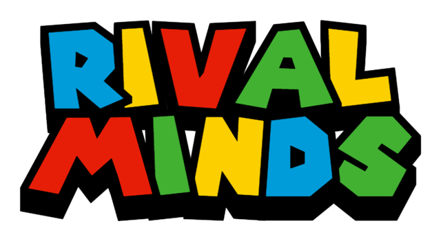

### A live reinforcement-learning tournament

Two agents, **Red** and **Blue**, play the **same** task head-to-head while you
watch them learn (or plan) live and on-screen. Five rounds, five algorithm
families, one 3D arena each.


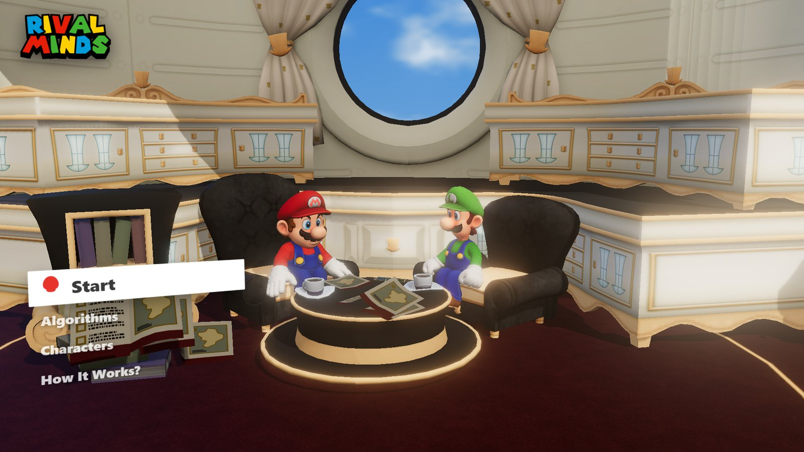

</div>

---

## What it is

The two models are **real Python reinforcement learning** running in a background
thread; the browser is a live 3D viewer that polls the match and renders it. Each
side owns an independent model. In New Donk City they learn mirrored copies of
the same seeded course and do not observe the rival, keeping the tabular state
Markov and the competition fair.

You pick the two characters in the start menu: **Blue is you**, **Red is the CPU**
(the CPU's arena-specific hyperparameters scale with the character's strength).
Red uses the CPU character's compatible algorithm; Blue uses your selected
algorithm.

<table>
<tr>
<td width="50%">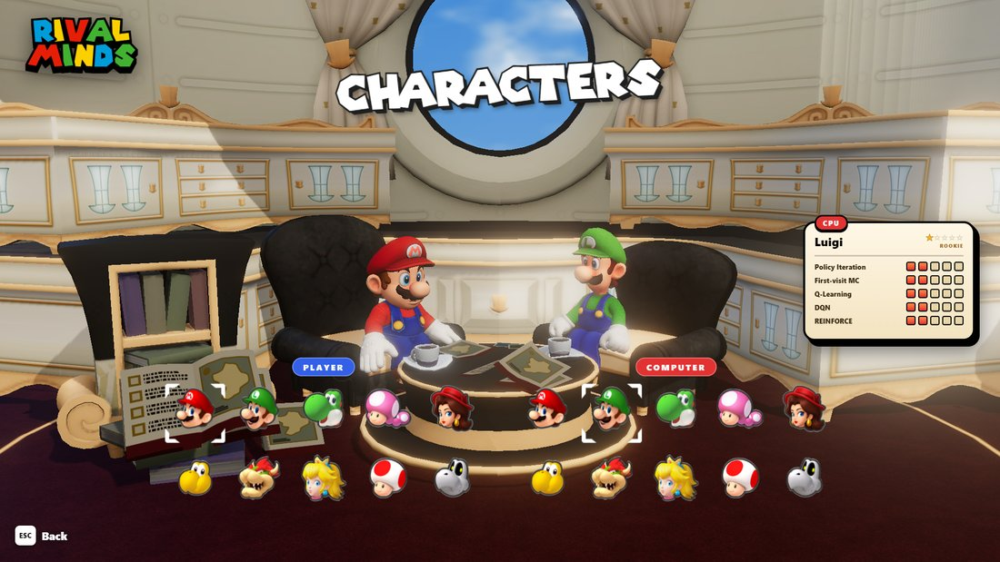</td>
<td width="50%">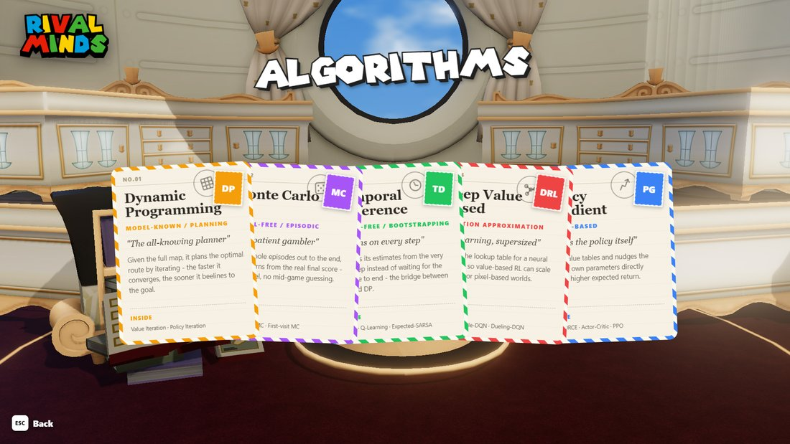</td>
</tr>
<tr>
<td align="center"><b>Draft your line-up.</b> Ten characters, each a difficulty
tier that maps to real hyperparameters.</td>
<td align="center"><b>Five families, one pick each.</b> The card you choose is
the algorithm Blue plays in that round.</td>
</tr>
</table>

<div align="center">
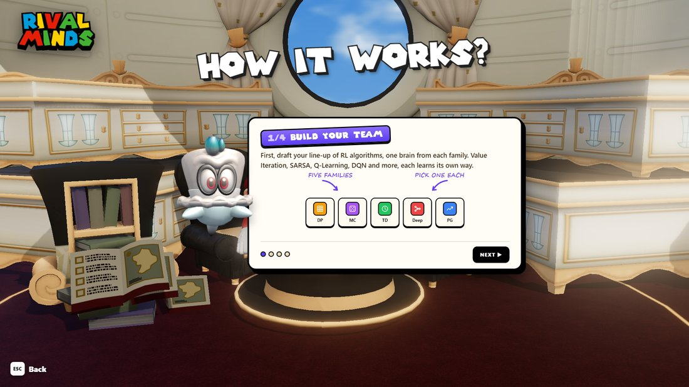
<br>
<i>A four-card walkthrough explains the whole tournament before you start.</i>
</div>

## The tournament

Each round pits two **rival algorithms** against each other in a themed arena.
The table shows the defaults; the start menu accepts any algorithm from that
round's compatible family:

| Round | Arena          | Red vs Blue                                                                               |
| ----- | -------------- | ----------------------------------------------------------------------------------------- |
| 1     | Peach's Castle | **Value Iteration** vs **Policy Iteration** (Dynamic Programming: a stochastic maze race) |
| 2     | New Donk City  | **Every-visit MC** vs **First-visit MC** (Monte-Carlo)                                    |
| 3     | Fossil Falls   | **SARSA** vs **Q-Learning** (on-policy vs off-policy TD)                                  |
| 4     | Ruined Kingdom | **DQN** vs **Double-DQN** (continuous, function approximation)                            |
| 5     | Dry Dry Desert | **Actor-Critic** vs **PPO** (Policy Gradient)                                             |

<table>
<tr>
<td width="50%">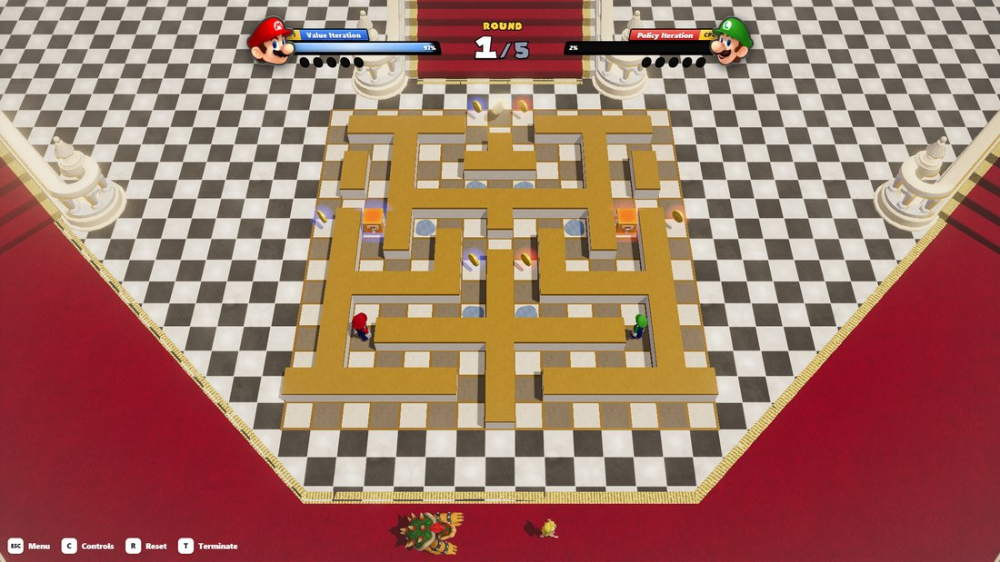</td>
<td width="50%">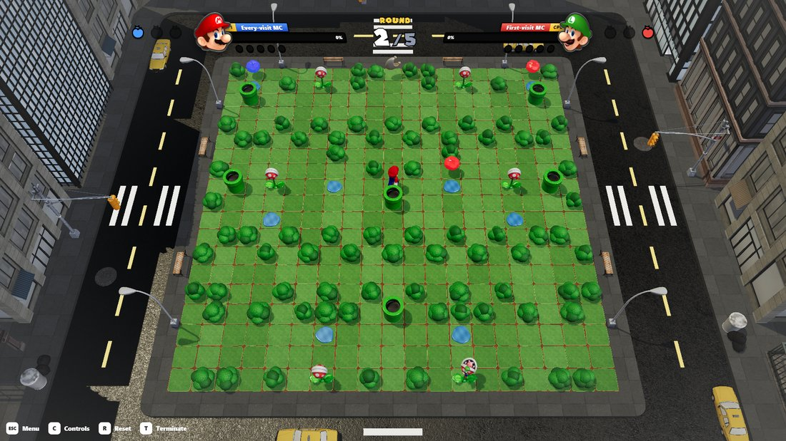</td>
</tr>
<tr>
<td align="center"><b>1 &middot; Peach's Castle</b><br>Dynamic Programming. Ice
tiles slip, Mystery Blocks gamble, and the model is known, so both sides
<i>plan</i> instead of sampling.</td>
<td align="center"><b>2 &middot; New Donk City</b><br>Monte-Carlo. Collect three
tomatoes, then reach the goal, learning only from whole-episode returns.</td>
</tr>
<tr>
<td width="50%">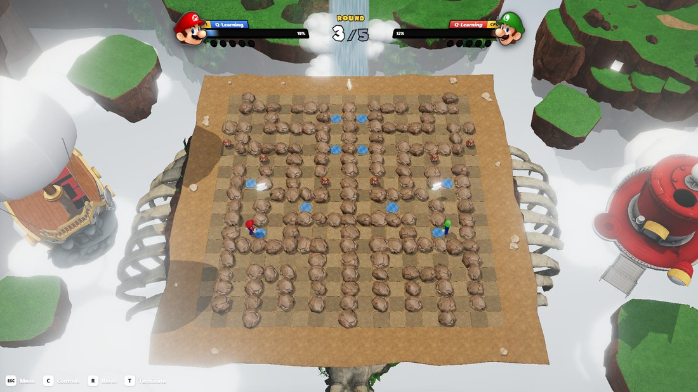</td>
<td width="50%">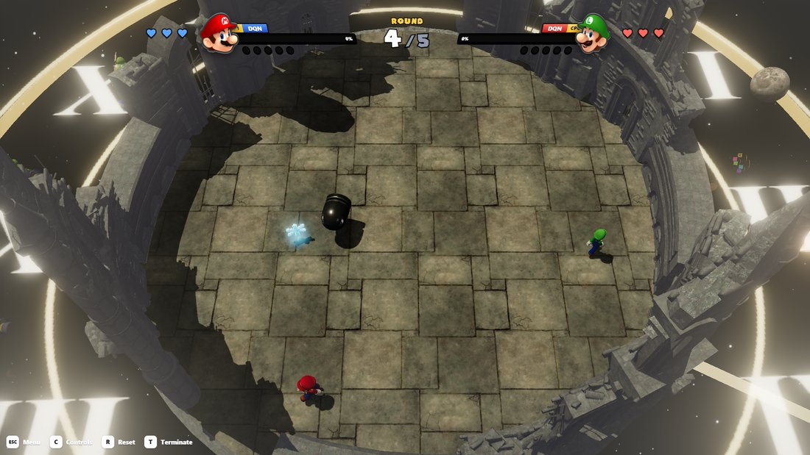</td>
</tr>
<tr>
<td align="center"><b>3 &middot; Fossil Falls</b><br>Temporal Difference. A random
perfect maze, patrolling Goombas, SARSA against Q-Learning.</td>
<td align="center"><b>4 &middot; Ruined Kingdom</b><br>Deep RL. Continuous physics,
a 55-vector observation, Banzai Bills to dodge, three hearts each.</td>
</tr>
<tr>
<td width="50%">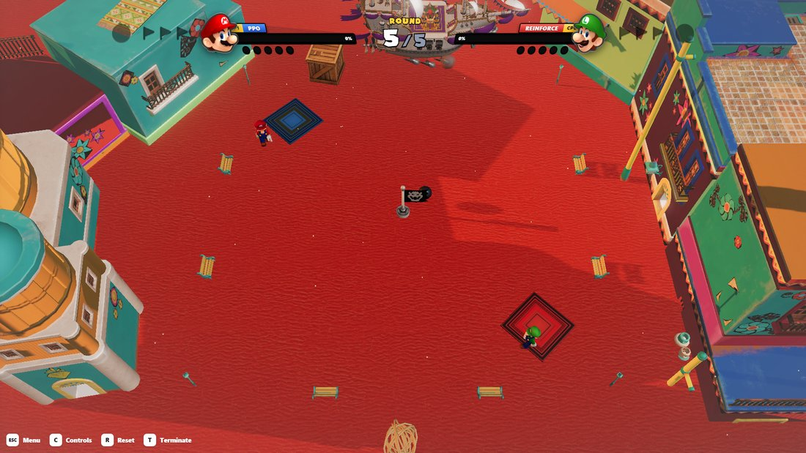</td>
<td width="50%" valign="top">

**5 &middot; Dry Dry Desert**

Policy Gradient. Capture the flag: grab it from the centre, carry it to your
base, and lose it instantly to a tag. Crates drop kart weapons fired from a
tenth action, and Bowser's airship throws objects the policy has to dodge.

First to **3 captures** takes the tournament's last stage points.

</td>
</tr>
</table>

## Run

```sh
python serve.py
```

A local server starts, runs the two models live, and opens the game in your
browser. Keep the console window open. (Needs Python 3 + `gymnasium` + `numpy`;
`torch` only for the DQN rounds.)

There is no build step and no package manager: three.js is vendored, and that
one script serves the whole game.

## What you are looking at

The HUD names both algorithms, tracks the live win bars, and marks the five
rounds as dots. Everything else lives in the **Control panel** (`C`), a docked
menu whose tab row walks from "what is the task" all the way to "what has the
model actually learned".

<table>
<tr>
<td width="50%">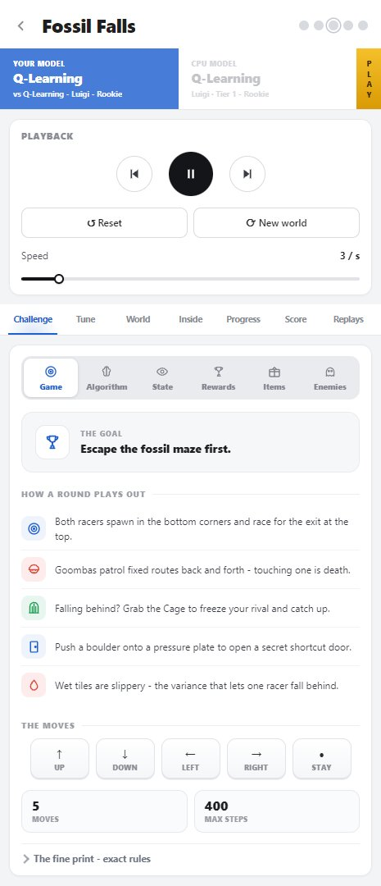</td>
<td width="50%">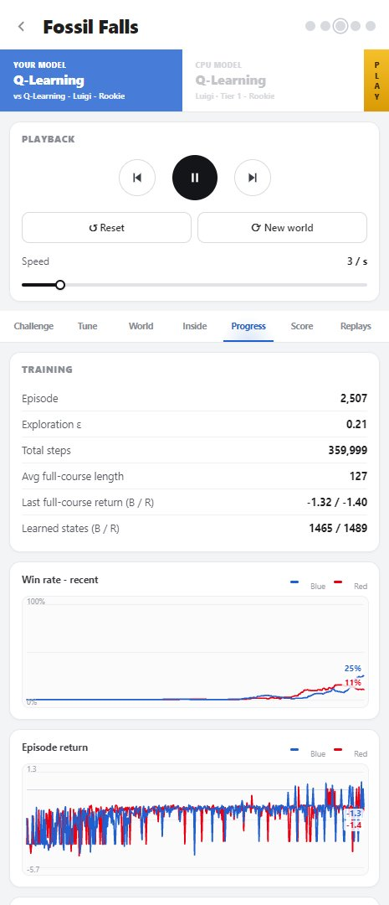</td>
</tr>
<tr>
<td align="center"><b>Challenge.</b> The MDP card: the goal, how a round plays
out, the move set and the step cap, generated live from the running arena.</td>
<td align="center"><b>Progress.</b> Episode counters and the learning curves:
return, episode length, epsilon and win rate over time.</td>
</tr>
<tr>
<td width="50%">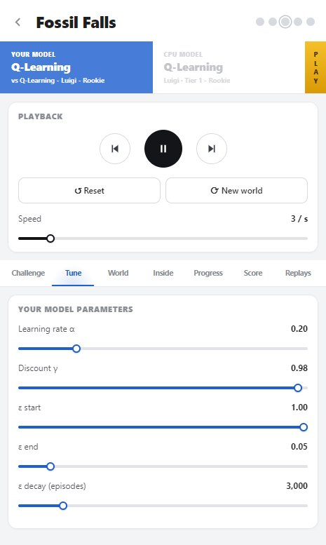</td>
<td width="50%">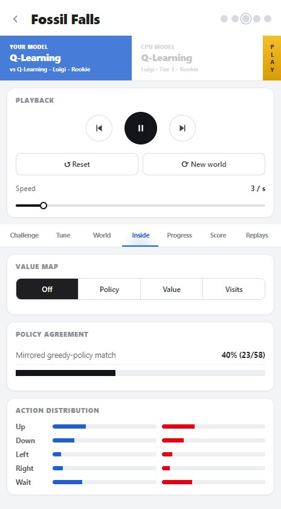</td>
</tr>
<tr>
<td align="center"><b>Tune.</b> Alpha, gamma and the epsilon schedule, live.
Move a slider and the learning changes under you.</td>
<td align="center"><b>Inside.</b> The value map switch, policy agreement, DP
residuals and the per-algorithm internals.</td>
</tr>
<tr>
<td width="50%">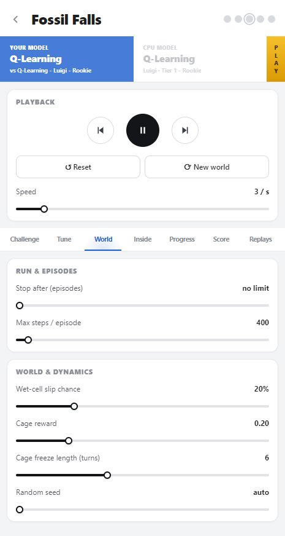</td>
<td width="50%">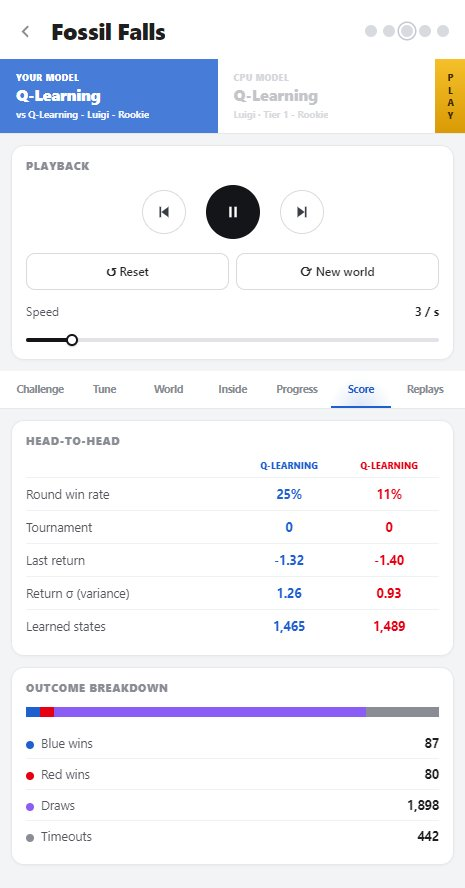</td>
</tr>
<tr>
<td align="center"><b>World.</b> The deeper knobs: run length, algorithm
internals, environment dynamics, the reproducibility seed.</td>
<td align="center"><b>Score.</b> The head-to-head tally and recent win-rate
bars, per round and across the tournament.</td>
</tr>
<tr>
<td width="50%">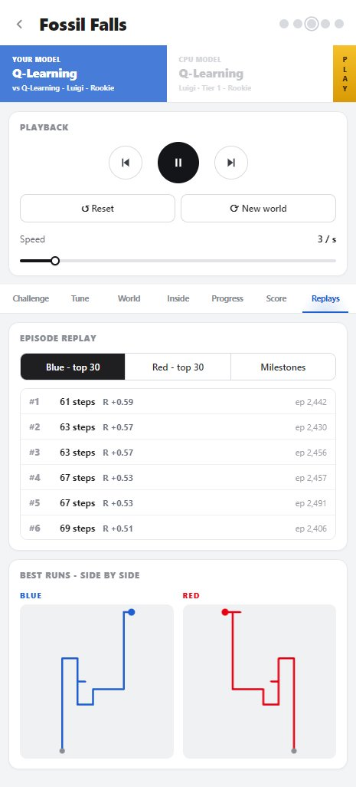</td>
<td width="50%" valign="top">

**Replays**

Every model keeps its best complete winning runs. Pick one and the board
replays it with the policy, value, Q and visit context **frozen at that
episode**, so you are watching what the model knew then, not what it knows now.

There is a Milestones category too: the first win, the first goal, the first
death by hazard.

</td>
</tr>
</table>

## Seeing inside the model

The overlays put the learned numbers straight onto the board: **Value** prints
V(s) on every square, **Policy** draws the greedy action as one arrow per tile,
and **Visits** paints how often each tile has been tried. Click a tile in any
mode to read its per-action **Q(s, a)**.

<table>
<tr>
<td width="50%">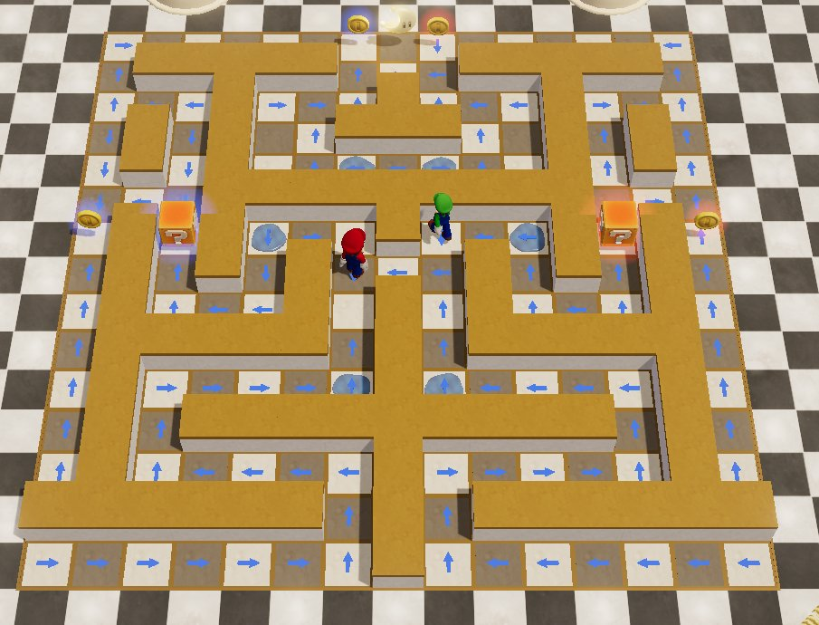</td>
<td width="50%">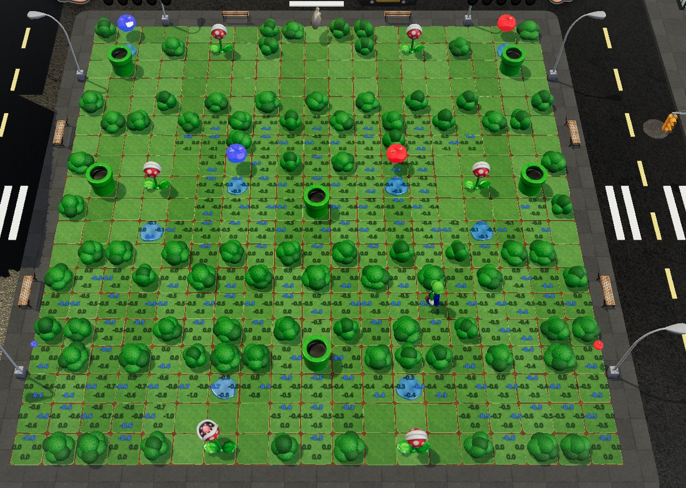</td>
</tr>
<tr>
<td align="center"><b>What it would do.</b> One arrow per tile. Dynamic
Programming has swept the whole castle, so every square already points
somewhere.</td>
<td align="center"><b>What it thinks a square is worth.</b> Monte-Carlo fills
V(s) in from the goal backwards, so the numbers thin out where it rarely
finished an episode.</td>
</tr>
</table>

<div align="center">
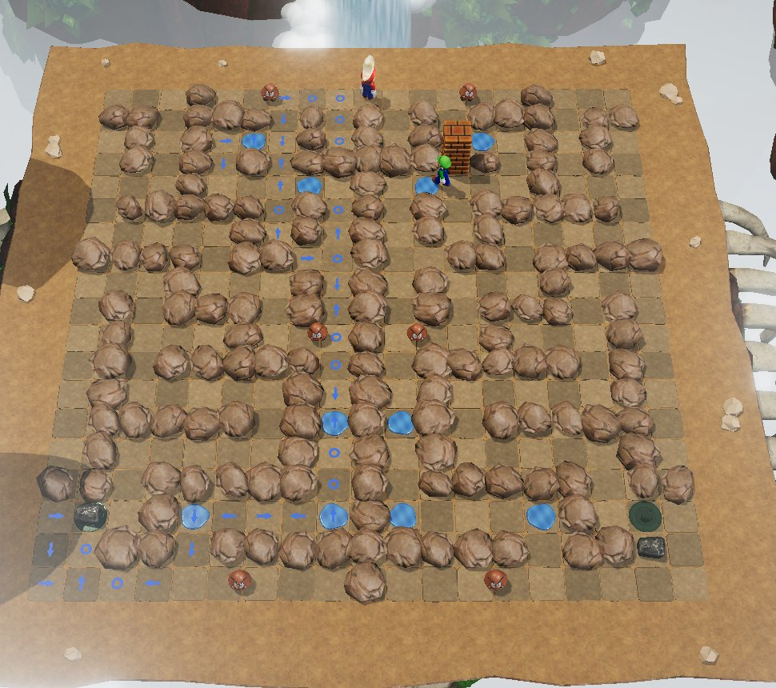
<br>
<i>The same overlay on Fossil Falls: a 19x19 perfect maze solved one TD step at a time.</i>
</div>

## The five rooms - states, rewards, and the hyperparameters that solve them

Every room is a small **escape room**: reach its single terminal (the goal / final
capture) to advance. The reward always includes a **per-step time cost**, so a faster
solution earns a higher return - solving quickly _is_ the objective. Difficulty rises
room to room (bigger state space, more actions, dynamic hazards). The "tuned" values
below are the Blue defaults the app ships with (they solve each room reliably); every
one is live-editable from the Control panel (`C`).

Each room folds open below: the full MDP, the ten-character CPU ladder, and the
measured hyperparameter search that found the best settings against Parabones.

<details>
<summary><b>Room 1 - Peach's Castle (Dynamic Programming: Value Iteration vs Policy Iteration)</b></summary>
<br>


Model **known**, so we _plan_ with the Bellman equations instead of sampling.

- **State (|S| ~ 23,000; seed-dependent, e.g. 23,488 on seed 1 - the briefing card
  shows the exact live number):** `(your tile x collected-mask x status)` = ~140 floor
  tiles (plus the interior wall tiles reachable while ghosting) x a 4-bit mask of which
  of your coins / Mystery Blocks you have claimed x an 8-value power-up / frozen
  countdown. It is a genuine **stochastic MDP**: **ice tiles** slip
  (30% chance a move deflects sideways) and Mystery Blocks give a random Ghost/Freeze
  outcome, so the transition `P(s'|s,a)` is probabilistic and known to the planner.
- **Actions (4):** Up / Down / Left / Right.
- **Rewards:** step `-0.01`; coin `+0.2`; Mystery-Block bonus `+0.15`; reach the Power
  Moon `+1.0`; lose `-1.0`.
- **Terminal:** first to the Power Moon (a dead heat draws).
- **Tuned params (DP has no alpha/epsilon):** discount **gamma = 0.98**, convergence
  threshold **theta = 1e-5**, sweep cap **2000**, planning speed **0.6** Bellman sweeps
  per tick, ice slip **30%**. VI and PI both converge to the same optimal V\*; the race
  is which planner gets a usable partial policy first.

**The 10 CPU characters (Round 1).** DP has no learning knobs, so a character's
strength is its **planning speed** (Bellman sweeps per tick); gamma 0.98 and
theta 1e-5 are shared globals. Why speed is the whole ladder: every planner
converges to the same optimal policy, so the only possible edge is converging
_sooner_.

| Level | Character | plan_speed (sweeps/tick) |
| ----- | --------- | ------------------------ |
| 0     | Mario     | 0.15                     |
| 1     | Luigi     | 0.30                     |
| 2     | Yoshi     | 0.50                     |
| 3     | Toadette  | 0.75                     |
| 4     | Pauline   | 1.05                     |
| 5     | Koopa     | 1.40                     |
| 6     | Bowser    | 1.80                     |
| 7     | Peach     | 2.25                     |
| 8     | Toad      | 2.80                     |
| 9     | Parabones | 3.40                     |

**The best measured settings (search + numbers).** Method: full tournament
matches of 30 races against Parabones (level 9) over 3 world seeds, scored on
all 30 races (after both planners converge every race draws, so the early
races are the contest). Measured Blue win rates, Policy Iteration as the card:
dpPlanning 0.6 (default) **15.6%**, 3.4 **20.0%**, 5 **20.0%**, 8 **20.0%**,
10 **21.1%** vs Red's 33.3% - planning speed saturates because Truncated PI
only improves its policy every 8 evaluation sweeps, while Value Iteration
improves every sweep, so VI always fields a usable policy earlier. Gamma
probes at plan 10: gamma 0.99 **11.1%** (value propagation slows, convergence
takes more sweeps), gamma 0.90 **21.1%** (no better than 0.98). The measured
best-beyond-Parabones set is therefore **pick Value Iteration as your card,
dpPlanning 10.0, gamma 0.98, theta 1e-5**: Blue 33.3% vs Red 21.1% (rest
draws) over the same 90 races - the only measured configuration that
out-races Parabones. Why each value: planning speed 10 because in a
convergence race raw sweep throughput is the score; gamma 0.98 because higher
values slow the value wave without changing the route, and lower ones do not
speed it further; theta 1e-5 because a looser threshold stops the plan before
the coin detours are priced correctly.

</details>

<details>
<summary><b>Room 2 - New Donk City (Monte-Carlo control: First-visit vs Every-visit)</b></summary>
<br>


Model **unknown**; the agent learns only from **complete-episode returns** (no
bootstrapping). A creative extra beyond the brief's SARSA/Q pair - Monte Carlo completes
the Sutton and Barto progression, and SARSA and Q-Learning both appear next door in Room 3.

- **State (|S| ~ 2,100; seed-dependent, e.g. 2,088 on seed 1):** `(your tile x 3-bit
tomato mask)` = ~260 reachable cells x which of your 3 tomatoes you already hold. The mask keeps the state **Markov** (the
  return-to-goal depends on what you still need to collect). **Puddles** add a 12% skid.
- **Actions (4):** Up / Down / Left / Right.
- **Rewards:** step `-0.01`; collect a tomato (first time) `+0.35`; gather all 3 + reach
  the goal `+1.0`; eaten in a plant zone `-1.0`.
- **Terminal:** hold all 3 tomatoes, then reach the top goal.
- **Tuned params:** **alpha = 0.19**, **gamma = 0.98**, epsilon **0.90 -> 0.05** decayed
  over **7,200** episodes. MC needs _sustained_ exploration because an update only lands
  after a long full-course return - hence the long decay.

**The 10 CPU characters (Round 2).** The MC ladder holds a HIGH final epsilon
(full-return learning collapses if exploration dies out), decaying it less and
learning slightly faster as levels rise; gamma 0.98 throughout (it beat 0.995
in the long-course benchmark).

| Level | Character | alpha | gamma | eps start | eps end | decay episodes |
| ----- | --------- | ----- | ----- | --------- | ------- | -------------- |
| 0     | Mario     | 0.14  | 0.98  | 1.00      | 0.40    | 11000          |
| 1     | Luigi     | 0.15  | 0.98  | 0.98      | 0.36    | 10000          |
| 2     | Yoshi     | 0.16  | 0.98  | 0.96      | 0.33    | 9500           |
| 3     | Toadette  | 0.17  | 0.98  | 0.94      | 0.29    | 8500           |
| 4     | Pauline   | 0.18  | 0.98  | 0.92      | 0.27    | 8000           |
| 5     | Koopa     | 0.19  | 0.98  | 0.90      | 0.23    | 7200           |
| 6     | Bowser    | 0.20  | 0.98  | 0.88      | 0.23    | 7000           |
| 7     | Peach     | 0.21  | 0.98  | 0.87      | 0.19    | 6500           |
| 8     | Toad      | 0.22  | 0.98  | 0.86      | 0.20    | 6000           |
| 9     | Parabones | 0.22  | 0.98  | 0.86      | 0.16    | 6000           |

**The best measured settings (search + numbers).** Method: train Blue
(First-visit MC) for 12,000 episodes against Parabones inside the real
tournament loop (exploring-starts curriculum included), score the last 3,000
full-course races; 5 seeds for the two finalists, 2 for the rest. Results
(Blue win rate; the remainder is mostly timeouts/double-deaths - Parabones
itself never exceeds 15% and averages under 7%): shipped default (alpha .19,
eps .90->.05 over 7200) **41%** mean (0.57 / 0.32 / 0.33 / 0.47 / 0.36); the
same schedule with **eps end 0.02** wins **62%** mean and beat the default on
4 of 5 seeds (0.92 / 0.00 / 0.91 / 0.68 / 0.59 - the one exception is a hard
world seed where BOTH sides timed out of nearly every race, an honest
reminder that long-horizon MC can stall on an unlucky course). Parabones' own
profile on Blue reaches only **17%** (its held eps 0.16 keeps stumbling into
plants); alpha 0.15 **16%**, alpha 0.24-0.30 **10-16%** (too big for
full-return noise); gamma 0.995 **21%**; eps end 0.10 **16%**. The measured
best set: **alpha 0.19, gamma 0.98, epsilon 0.90 -> 0.02 over 7,200
episodes**. Why each value: alpha 0.19
(applied x0.25 inside MC) is as fast as the high-variance full returns allow
before Q wobbles off the optimum; gamma 0.98 keeps the 40+-step course worth
finishing without drowning the tomato bonuses; the long 7,200-episode decay
keeps rare full-course returns flowing while the table is still forming; and
the low 0.02 floor matters because at 400 steps per episode even 5% random
moves eventually step into a plant zone.

</details>

<details>
<summary><b>Room 3 - Fossil Falls (Temporal-Difference control: SARSA vs Q-Learning)</b></summary>
<br>


Model **unknown**, learned online with **one-step TD** - **SARSA** (on-policy) races
**Q-Learning** (off-policy) head-to-head, so the brief's Room-2 (SARSA) and Room-3
(Q-Learning) requirements are both demonstrated here.

- **State (|S| ~ 9,840 on most seeds; halves when a seed generates no plate puzzle):**
  `(your tile x Goomba patrol phase x rival flag x secret-door flag)` = ~205 cells x the
  patrol phase the Goombas cycle on (4 at the defaults) x a compact ahead/level/behind +
  cage-ready rival flag (6) x whether your pressure-plate door is open. A **wet-cell skid** (tunable, ~20%) is the variance that lets a racer fall behind.
- **Actions (5):** Up / Down / Left / Right / **Stay** (wait out a Goomba).
- **Rewards:** step `-0.01`; reach the goal first `+1.0`; grab your cage (freeze the
  rival) `+0.2`; caught by a Goomba `-1.0`; rival finishes first `-1.0`.
- **Terminal:** first to the shared exit at top-centre.
- **Tuned params:** **alpha = 0.20**, **gamma = 0.98**, epsilon **1.0 -> 0.05** over
  **3,000** episodes.

**The 10 CPU characters (Round 3).** Every character learns a WORKING policy
within ~2k episodes (eps starts at 1.0 with a short decay); the difficulty is
the final epsilon each keeps playing at forever - Mario stays a dithering 40%
random, Parabones a near-optimal 2%.

| Level | Character | alpha | gamma | eps start | eps end | decay episodes |
| ----- | --------- | ----- | ----- | --------- | ------- | -------------- |
| 0     | Mario     | 0.24  | 0.98  | 1.00      | 0.40    | 2200           |
| 1     | Luigi     | 0.26  | 0.98  | 1.00      | 0.35    | 2000           |
| 2     | Yoshi     | 0.28  | 0.98  | 1.00      | 0.30    | 1800           |
| 3     | Toadette  | 0.30  | 0.98  | 1.00      | 0.25    | 1600           |
| 4     | Pauline   | 0.32  | 0.98  | 1.00      | 0.20    | 1400           |
| 5     | Koopa     | 0.34  | 0.98  | 1.00      | 0.15    | 1200           |
| 6     | Bowser    | 0.36  | 0.98  | 1.00      | 0.11    | 1000           |
| 7     | Peach     | 0.38  | 0.98  | 1.00      | 0.08    | 850            |
| 8     | Toad      | 0.39  | 0.98  | 1.00      | 0.05    | 700            |
| 9     | Parabones | 0.40  | 0.98  | 1.00      | 0.02    | 550            |

**The best measured settings (search + numbers).** Method: train Blue
(Q-Learning) for 5,000 episodes against Parabones (SARSA), score the last
1,500 races; 2 seeds per candidate. Results: the generic Blue default (alpha
.20, eps -> .05 over 3000) collapses to **1.8%** against a converged Parabones

- it explores far too long against an opponent that is already optimal at
  episode 550. Cloning Parabones' own profile onto Q-Learning wins **98.3%**:
  **alpha 0.40, gamma 0.98, epsilon 1.0 -> 0.02 over 550 episodes** - the
  measured best set. Neighbors confirm the peak: alpha .30/eps .05 **90.5%**,
  alpha .50/eps .01/400 **79.3%** (decays slightly too fast), gamma 0.995
  **84.9%**, alpha .40/eps .05 **81.9%**, Expected-SARSA on the same profile
  **83.6%**. The 98%-vs-1% swing with identical settings on both sides is the
  round's lesson made measurable: off-policy Q-Learning learns the OPTIMAL
  policy while on-policy SARSA learns its own epsilon-tainted one, so at equal
  hyperparameters the Q-Learner simply outperforms. Why each value: alpha 0.40
  is safe because one-step TD targets are low-variance; the 550-episode decay
  matches how fast value propagates through a 19x19 maze; eps end 0.02 wins the
  endgame because in a head-to-head race every residual random step is a lost
  tempo; gamma 0.98 prices the ~40-step route without slowing propagation.

</details>

<details>
<summary><b>Room 4 - Ruined Kingdom (Deep RL / function approximation: DQN vs Double-DQN)</b></summary>
<br>


Model **unknown**, state **continuous**, so a neural network approximates Q. Built to
the brief's spec: a **10 x 10 metre** room, a **0.02 s** decision step, and **discrete
velocity** on each axis (`Vx, Vy in {-1, 0, 1}`, no momentum). Movement stability comes
from **action-repeat** (a chosen heading is held for 4 steps) rather than momentum.

- **State (55-vector):** 5 own kinematics (position x/z, velocity x/z, rim clearance) +
  5 own effect timers (speed / shield / slow / freeze / post-hit mercy) + the 3 nearest
  Banzai Bills x 8 (present, relative x/z, velocity x/z, aimed-at-me, time-to-impact,
  predicted miss) + the 3 nearest pickups x 7 (present, relative x/z, 4-way type one-hot).
- **Actions (9):** 8 directions (incl. diagonals) + stay.
- **Rewards:** stay alive `+0.2 / s`; dodge a Bill aimed at you `+0.15`; shift a closing
  missile's projected miss `+/-0.25 / s`; lose a heart `-2.0`; rival loses its last heart
  `+0.05`.
- **Terminal:** each racer has 3 hearts; a hit costs one - last one standing wins.
- **Tuned params:** learning rate **alpha = 0.30** (Adam lr), **gamma = 0.99**, epsilon
  **1.0 -> 0.05** over **2,500** episodes; network **128 x 2**, minibatch **64**, replay
  buffer **50,000**, **500**-step warmup, target-net sync every **500** steps, **3-step**
  returns, **action-repeat 4**.

**The 10 CPU characters (Round 4).** A stronger character plays closer to
optimal (lower final epsilon = it DODGES instead of wandering into a Bill),
learns faster (fewer decay episodes), and looks further ahead (higher gamma).
All levels share the same network and training internals (128 x 2, batch 64,
buffer 50k, warmup 500, target sync 500, 3-step returns).

| Level | Character | alpha | gamma | eps start | eps end | decay episodes |
| ----- | --------- | ----- | ----- | --------- | ------- | -------------- |
| 0     | Mario     | 0.20  | 0.980 | 1.00      | 0.30    | 4000           |
| 1     | Luigi     | 0.22  | 0.980 | 1.00      | 0.26    | 3600           |
| 2     | Yoshi     | 0.24  | 0.982 | 1.00      | 0.22    | 3200           |
| 3     | Toadette  | 0.26  | 0.984 | 0.98      | 0.18    | 2800           |
| 4     | Pauline   | 0.28  | 0.986 | 0.96      | 0.15    | 2400           |
| 5     | Koopa     | 0.30  | 0.988 | 0.94      | 0.12    | 2000           |
| 6     | Bowser    | 0.32  | 0.990 | 0.92      | 0.09    | 1600           |
| 7     | Peach     | 0.34  | 0.992 | 0.90      | 0.07    | 1200           |
| 8     | Toad      | 0.36  | 0.994 | 0.88      | 0.05    | 900            |
| 9     | Parabones | 0.38  | 0.995 | 0.85      | 0.03    | 600            |

**The best measured settings (search + numbers).** Method: train Blue for 700
episodes against Parabones (DQN, level 9) inside the real tournament loop
(curriculum + action-repeat included), score the last 200 episodes; 2 seeds per
candidate, ~40 minutes of CPU training per run. Results (Blue win rate): the
shipped Blue default (Double-DQN, alpha .30, gamma .99, eps -> .05 over 1,000)
already edges Parabones at **53%** - Double-DQN's corrected bootstrap beats
vanilla DQN at comparable settings; cloning Parabones' schedule onto Double-DQN
gains nothing (**47%**); target-sync 250 **51%**; Parabones' schedule + n-step
5 **61%**; + hidden width 256 **63%**; and **Dueling-DQN on Parabones'
schedule wins 66%** (0.72 / 0.60 across seeds - its worse seed still beats
every pb-clone seed). The measured best set: **Dueling-DQN, alpha 0.38, gamma
0.995, epsilon 0.85 -> 0.03 over 600 episodes, network 128 x 2, batch 64,
buffer 50k, warmup 500, target sync 500, 3-step returns**. Why each value:
the Dueling head wins because in a missile storm most of the value is WHERE
YOU STAND (V) rather than tiny per-action differences (A), which is exactly
the split it learns; alpha 0.38 / 600-episode decay because the curriculum
makes early episodes easy, so exploring long wastes them; gamma 0.995 because
staying alive is a hundreds-of-steps horizon; eps floor 0.03 because every
random step in a barrage is a heart risk; and the stock replay/target-sync
values were confirmed by the sync-250 probe changing nothing.

</details>

<details>
<summary><b>Room 5 - Dry Dry Desert (Policy Gradient: Actor-Critic vs PPO, also REINFORCE)</b></summary>
<br>


Model **unknown**, and the policy itself is a network (policy-_based_, not value-based) -
it **samples** its actions, so there is no epsilon; exploration comes from an **entropy
bonus**. This is the brief's optional obstacle room: **Bowser's Airship** hurls dynamic
objects the racers must **dodge**, and the observation exposes a **tunable sight range**
(how many metres ahead, centre-to-centre, an incoming object is seen). A fresh random
layout can be generated any time ("New world") to test the learned policy.

- **State (66-vector):** 4 own kinematics + 4 opponent terms (rival relative pos/vel) +
  5 flag terms (relative x/z + free / you-carry / rival-carries) + 4 base vectors +
  4 status terms (carrying, both stun timers, capture lead) + 2 crates x3 + a 5-way
  held-weapon one-hot + rival-armed flag + 2 shells x5 + 2 traps x4 + **3 thrown Bowser
  objects x5 within the sight range** (present, relative x/z, velocity x/z) - so it can
  dodge them.
- **Actions (10):** 8 thrust directions + coast + **USE** (fire the held weapon).
- **Rewards:** grab the flag `+0.15`; steal it (tag) `+0.40`; lose it `-0.40`; capture at
  your base `+1.0`; concede a capture `-0.30`; smash a crate `+0.10`; chain-yank `+0.08`;
  shell hit `+0.30`; banana/oil snare `+0.25`; get stunned `-0.05`; win the round `+/-2.0`;
  step `-0.002`.
- **Terminal:** first to **3 captures** (else most captures at timeout).
- **Tuned params:** learning rate **alpha = 0.20**, **gamma = 0.98**, entropy bonus
  **0.01**, GAE **lambda = 0.95**, value-loss weight **0.5**, rollout **horizon** (64 for
  Actor-Critic, 512 for PPO), PPO **clip = 0.2**, PPO **epochs = 4**, minibatch **128**,
  network **128**. Decision step **0.05 s**; object sight range **6 m** (tunable).

**The 10 CPU characters (Round 5).** Policy gradients have no epsilon (they
explore via policy ENTROPY), so difficulty is the learning rate, the discount,
and the entropy coefficient: a weak character learns slowly, plans
short-sighted, and stays random forever; a strong one learns fast and commits
to a sharp policy.

| Level | Character | alpha | gamma | entropy |
| ----- | --------- | ----- | ----- | ------- |
| 0     | Mario     | 0.10  | 0.970 | 0.050   |
| 1     | Luigi     | 0.14  | 0.972 | 0.042   |
| 2     | Yoshi     | 0.18  | 0.974 | 0.035   |
| 3     | Toadette  | 0.22  | 0.976 | 0.028   |
| 4     | Pauline   | 0.26  | 0.978 | 0.022   |
| 5     | Koopa     | 0.30  | 0.980 | 0.017   |
| 6     | Bowser    | 0.34  | 0.983 | 0.013   |
| 7     | Peach     | 0.38  | 0.986 | 0.009   |
| 8     | Toad      | 0.42  | 0.988 | 0.006   |
| 9     | Parabones | 0.46  | 0.990 | 0.004   |

**The best measured settings (search + numbers).** Method: train Blue for 450
episodes against Parabones (Actor-Critic, level 9) inside the real tournament
loop, score the last 150 episodes; 2 seeds per candidate (~10 minutes of CPU
per run). Results (Blue win rate, seeds shown because policy-gradient variance
is real): the shipped PPO default (alpha .20, gamma .98, entropy .01) averages
**57%** (0.16 / 0.97 - the weak seed let Red take 50%); learning-rate probes:
alpha .30 + gamma .99 **76%**, alpha .46 (Parabones' own rate) **51%** with one
collapsed seed (Red 65% - too hot for PPO's multi-epoch reuse); horizon 256
**58%**; epochs 6 + clip 0.15 **83%**; and **entropy 0.003 wins at 90%**
(1.00 / 0.79) while holding Red to ZERO wins on both seeds. Running
Actor-Critic on Blue with Parabones' own profile manages only **27%** -
PPO's clipped multi-epoch updates beat the single-step critic no matter the
knobs, which is the round's thesis measured. The best set: **PPO, alpha 0.20,
gamma 0.98, entropy 0.003, horizon 512, clip 0.2, epochs 4, minibatch 128,
GAE lambda 0.95**. Why each value: entropy 0.003 is the headline - the
default 0.01 keeps the policy dithering long after it should commit, while
0.003 (just under Parabones' 0.004) lets it sharpen into decisive
grab-juke-capture lines without collapsing early; alpha stays at 0.20 because
policy steps compound over 4 reuse epochs (0.46 demonstrably destabilizes);
gamma 0.98 covers the grab-to-capture chain; and the stock horizon/clip/epoch
values were each probed and not beaten cleanly.

</details>

The CPU (Red) reads the same knobs, but its values come from the chosen character's
**difficulty tier** (10 characters, easy -> hard): a weaker character learns slower
(lower alpha), plans less far (lower gamma), and stays more random (higher epsilon, or
higher entropy in Room 5); a stronger one converges fast and plays near-optimally.


## Controls

| Input         | Action                                       |
| ------------- | -------------------------------------------- |
| `R`           | **Reset** both models (relearn from scratch) |
| `C`           | Open/close the shared **Control** panel      |
| `ESC`         | Quit the run and return to the start menu    |
| Mouse drag    | Pan the camera                               |
| WASD / arrows | Pan the camera                               |
| Scroll wheel  | Zoom                                         |

## Control panel reference

- **Playback** - play/pause, speed (slow = watch them walk, fast = thousands of
  iterations fly by), reset, new world, and prev/next round.
- **Hyperparameters** - discount γ (all rounds), plus learning rate α and the ε
  exploration schedule on the learning rounds. Blue sliders tune your model.
- **Training stats** - episode, total steps, ε, average episode length, returns,
  learned-state counts.
- **DP convergence** (Round 1) - per-sweep Bellman residual and mean state value for
  Value Iteration vs Policy Iteration, with a tunable convergence θ.
- **Learning curves** - return, episode length, ε, and win-rate over time.
- **Contest** - live win tally + recent win-rate bars.
- **Value map** - overlay each model's **V(s)** heatmap on the grid; click a tile to
  inspect the per-action **Q(s,·)**.
- **Episode replay** - browse each model's top 30 complete winning runs. Arena 2
  replays use the policy, value, Q, and visit context frozen with that episode.
  The model selector in the panel header switches between your Blue model and the
  CPU's locked Red profile.

## How the RL concepts are captured

| Concept                | Where                                                              |
| ---------------------- | ------------------------------------------------------------------ |
| Gymnasium env          | `rl/core/grid_env.py` / `rl/core/continuous_arena.py`              |
| Dynamic Programming    | Value + Policy Iteration (`rl/arenas/r1_peach_castle/`)            |
| Monte-Carlo control    | episode-return updates (`rl/arenas/r2_new_donk_city/`)             |
| TD control             | Q-Learning / SARSA / Expected-SARSA (`rl/arenas/r3_fossil_falls/`) |
| Function approximation | DQN / Double-DQN / Dueling-DQN (`rl/arenas/r4_ruined_kingdom/`)    |
| Policy gradient        | Actor-Critic / PPO / REINFORCE (`rl/arenas/r5_tostarena/`)         |
| Explore vs exploit     | ε-greedy with a decaying ε (shown live in the panel)               |
| V & Q functions        | the value heatmap (V) + the click-a-tile Q inspector               |

## Code map

The Python is organized as a shared **core** plus one package **per arena**, so
"where is X?" always has a one-hop answer (the full question-to-symbol table is
in [`CODE_MAP.md`](CODE_MAP.md); the from-zero course guide is
[`GUIDE_EN.md`](GUIDE_EN.md) / [`GUIDE_HE.md`](GUIDE_HE.md)):

| File / folder                                            | What it does                                                                        |
| -------------------------------------------------------- | ----------------------------------------------------------------------------------- |
| `serve.py`                                               | Live RL server: static host + training thread + JSON API                            |
| `rl/core/grid_env.py`                                    | The shared two-agent grid engine (Rounds 1-3)                                       |
| `rl/core/continuous_arena.py`                            | The shared continuous physics engine (Rounds 4-5)                                   |
| `rl/core/worldgen.py`                                    | The `World` container + tile alphabet + validator                                   |
| `rl/core/base_agent.py`                                  | The base tabular agent (Q-table + ε-greedy)                                         |
| `rl/core/registry.py`                                    | Round + algorithm registries (name -> class/env/world)                              |
| `rl/core/tournament.py`                                  | The `Match` driver (assembled from the mixins below)                                |
| `rl/core/match_loop.py`                                  | The episode lifecycle + `tick()`                                                    |
| `rl/core/ladders.py`                                     | The 10-character CPU difficulty ladders per arena                                   |
| `rl/core/controls.py` / `rounds.py`                      | Panel controls / round navigation + awards                                          |
| `rl/core/replays.py`                                     | Episode recording, top-30 + milestone replays                                       |
| `rl/core/briefing.py` / `telemetry.py` / `inspection.py` | The /api payloads (MDP card, stats, value grids)                                    |
| `rl/core/checkpoints.py`                                 | Round-4 DQN checkpoint persistence                                                  |
| `rl/arenas/r1_peach_castle/`                             | R1 world + env + `value_iteration.py` / `policy_iteration.py`                       |
| `rl/arenas/r2_new_donk_city/`                            | R2 world (+ course tools/checks) + env + `monte_carlo.py` / `first_visit_mc.py`     |
| `rl/arenas/r3_fossil_falls/`                             | R3 world + env + `qlearning.py` / `sarsa.py` / `expected_sarsa.py`                  |
| `rl/arenas/r4_ruined_kingdom/`                           | R4 arena (+ missiles/pickups) + `dqn.py` / `double_dqn.py` / `dueling_dqn.py`       |
| `rl/arenas/r5_tostarena/`                                | R5 arena (+ weapons) + `pg_base.py` / `reinforce.py` / `actor_critic.py` / `ppo.py` |
| `src/main.js`                                            | Live poll client: builds the scene, drives the render loop                          |
| `src/live.js`                                            | The two board agents, driven by polled frames                                       |
| `src/themes/`                                            | Per-round arena geometry, palette, sky and camera                                   |
| `src/startmenu.js`                                       | Character select + cinematic start menu                                             |
| `src/panel.js`                                           | The shared model/control panel (C)                                                  |
| `src/graphs.js`                                          | Learning-curve / DP-convergence charts + episode replay                             |
| `src/heatmap.js`                                         | The learned-value heatmap overlay                                                   |
| `vendor/three/`                                          | Bundled three.js (no package manager needed)                                        |

## API (for the curious)

```
GET  /api/snapshot          {worldVersion, frame, stats}   (browser polls ~30Hz)
GET  /api/world             {worldVersion, world}          (fetched on each round)
GET  /api/worlds            every round's world (prebuilt during the menu)
GET  /api/values?agent=red  value heatmap V(s) per tile
GET  /api/values?agent=red&cell=r,c   per-action Q for one tile
GET  /api/dp?agent=red      Round 1 DP convergence trace (per-sweep δ + mean V)
GET  /api/replays           top-30 complete winning runs for one model
GET  /api/replay            one replay by stable episode identity
POST /api/control           {cmd: play|pause|speed|reset|regenerate|setParams|
                             cpuTier|prevRound|nextRound|setRound|sideAlgo, ...}
```
